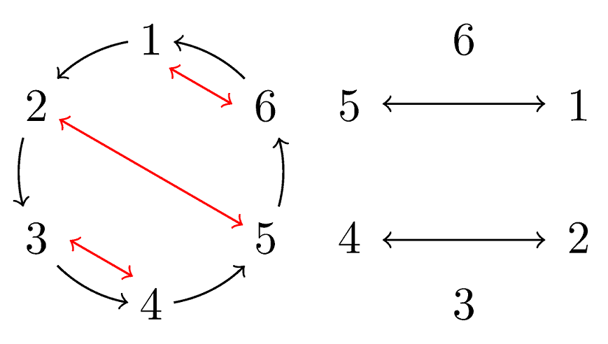

### [1294. A+B](https://acm.sjtu.edu.cn/OnlineJudge/problem/1294)

输入 $A, B$，请计算 $S = A + B$。

* 数据范围：共 $T \leq 10^6$ 组数据，每组 $0 \leq A, B \leq 10^9$

??? Solution
    
    请参考 [输入输出与基本数据类型](io.md) 中的内容。

    === "C++"
        ```cpp
        #include <bits/stdc++.h>
        using namespace std;

        int main() {
            cin.sync_with_stdio(false);
            cin.tie(nullptr);
            int T;
            cin >> T;
            while (T--) {
                int A, B;
                cin >> A >> B;
                cout << A + B << '\n';
            }
        }
        ```
        ```cpp
        #include <stdio.h>

        int main() {
            int T;
            scanf("%d", &T);
            while (T--) {
                int A, B;
                scanf("%d %d", &A, &B);
                printf("%d\n", A + B);
            }
        }
        ```
    === "Python"
        ```python
        T = int(input())
        for _ in range(T):
            A, B = map(int, input().split())
            print(A + B)
        ```
        上面这份代码会因为输入输出的速度过慢而超时；可以通过减少输入输出的次数来提高速度。
        ```python
        import sys
        output_buffer = []
        T = int(input())
        for line in sys.stdin.readlines():
            A, B = map(int, line.split())
            output_buffer.append(A + B)
        print("\n".join(map(str, output_buffer)))
        ```
        
### [1295. #include <random\>](https://acm.sjtu.edu.cn/OnlineJudge/problem/1295)

从 $1, 2, \dots, n$ 中独立均匀随机地取出两个整数 $X, Y$，请问 $X\times Y$ 是质数的概率是多少？

* 数据范围：$1 \leq n \leq 10 ^ 9$，答案与参考答案的误差需小于 $10^{-5}$

??? Solution

    只有两种情况满足条件：

    * $X = 1, Y$ 为质数；
    * $Y = 1, X$ 为质数。

    因此，如果 $\leq n$ 的质数有 $p$ 个，答案为 $2p / n^2$。

    由于 $p \leq n$，因此答案不超过 $2 / n$（或者，使用质数定理可以得到更准确的估计：$O(1 / n \log n)$）。因此，若要满足 $\varepsilon$ 的精度要求，对于超过 $\frac{1}{2 / \varepsilon}$ （或者 $\frac{ 1 }{-\varepsilon \log \varepsilon}$）的 $n$，答案均可以输出 $0$。

    使用最朴素的判定质数算法，复杂度为 $O(\frac {1}{\varepsilon} \sqrt \frac {1}{\varepsilon})$。
    
    === "C++"
        ```cpp
        #include <bits/stdc++.h>
        using namespace std;

        int main() {
            int n;
            cin >> n;
            int prime_count = 0;
            for (int i = 2; i <= min(10000, n); i++) {
                int is_prime = 1;
                for (int j = 2; j * j <= i; j++) {
                    if (i % j == 0) {
                        is_prime = 0; 
                        break;
                    }
                }
                prime_count += is_prime;
            }
            printf("%.9lf\n", prime_count * 2. / n / n);
        }
        ```
    === "Python"
        ```python
        n = int(input())
        def is_prime(x):
            for i in range(2, int(x**0.5) + 1):
                if x % i == 0:
                    return False
            return x >= 2
        prime_count = sum(is_prime(i) for i in range(2, min(n, 10000) + 1))
        print(f"{prime_count * 2 / n ** 2 :.9f}")
        ```
    当然，熟练的同学可能知道 [Meissel–Lehmer 算法](https://oi-wiki.org/math/number-theory/meissel-lehmer/)，在 $\tilde O(n ^ {2/3})$ 的时间复杂度下即可求出 $\leq n$ 的素数个数。本题为了保证数据正确，使用了该算法的结果作为参考答案。

### [1296. Shuffle](https://acm.sjtu.edu.cn/OnlineJudge/problem/1296)

给定一个长度为 $n$ 的排列，你需要通过最少的操作次数将其排序为 $1, 2, \dots, n$。每次操作可以选择若干个不相交的元素对，将它们分别交换。

* 数据范围：$1 \leq n \leq 10^5$

??? Solution

    > 本题题目来源是：ICPC 2021 昆明站 K 题：Parallel Sort，当然实际上这是一个十年前就出现过的经典题。  Fun fact: 交大现场参加的所有队伍都没有做出这道 81/579 通过率的题目。

    答案至多为 $2$。

    答案为 $0, 1$ 时非常好判断，也即将置换拆为轮换时，长度至多为 $1, 2$。

    由于存在置换长度为 $3$ 时，如 $[2, 3, 1]$，答案至少为 $2$。我们来构造一个针对每个长度 $r\geq 3$ 的轮换，两步归位的方法。我们设当前轮换内的元素为 $a_1, \cdots, a_r$，其中每个元素都希望归位到下一个元素所在位置。那么，我们依次交换 $(a_1, a_r), (a_2, a_{r - 1}), (a_3, a_{r - 2}) \dots$ 即可，这样会将大圈拆为大小不超过 $2$ 的轮换。之后一步归位即可。

    

    
    === "C++"
        ```cpp
        #include <bits/stdc++.h>
        using namespace std;

        int main() {
            int n;
            cin >> n;
            vector <int> a(n + 1);
            for (int i = 1; i <= n; i++) cin >> a[i];

            vector <vector <int>> ans;
            for ( ; ; ) {
                vector <int> vis(n + 1); // should not use vector<bool>
                vector <vector <int>> cycles;
                for (int i = 1; i <= n; i++) if (!vis[i]) {
                    int j = i;
                    vector <int> cycle;
                    while (!vis[j]) {
                        vis[j] = 1;
                        cycle.push_back(j);
                        j = a[j];
                    }
                    if (cycle.size() > 1) cycles.push_back(cycle);
                }
                if (cycles.empty()) break;
                vector <int> this_round;
                for (auto &cycle : cycles) {
                    for (int i = 0, j = (int) cycle.size() - 1; i < j; i++, j--) {
                        this_round.push_back(cycle[i]);
                        this_round.push_back(cycle[j]);
                        swap(a[cycle[i]], a[cycle[j]]);
                    }
                }
                ans.push_back(this_round);
            }
            
            cout << ans.size() << endl;
            for (auto &round : ans) {
                cout << round.size() / 2;
                for (auto i : round) cout << " " << i;
                cout << endl;
            }
        }
        ```
    === "Python"
        ```python
        n = int(input())
        a = [0] + list(map(int, input().split()))

        ans = []
        while True:
            vis = [False] * (n + 1)
            cycles = []
            for i in range(1, n + 1):
                if not vis[i]:
                    j = i
                    cycle = []
                    while not vis[j]:
                        vis[j] = True
                        cycle.append(j)
                        j = a[j]
                    if len(cycle) > 1:
                        cycles.append(cycle)

            if not cycles:
                break

            this_round = []
            for cycle in cycles:
                for i in range(len(cycle) // 2):
                    this_round.append(cycle[i])
                    this_round.append(cycle[-(i + 1)])
                    a[cycle[i]], a[cycle[-(i + 1)]] = a[cycle[-(i + 1)]], a[cycle[i]]
            ans.append(this_round)

        print(len(ans))
        for r in ans:
            print(len(r) // 2, *r)
        ```
### [1786. Ctrl + R](https://acm.sjtu.edu.cn/OnlineJudge/problem/1786)

给定两个同样长为 $n$ 的字符串序列 $S$, $T$，判断是否可以通过替换 $S$ 得到 $T$：是否存在一个函数 $f$，满足 $f(S_i) = T_i$。

* 数据范围：$1 \leq n \leq 10^3$，每组数据输入字符串的总长度不超过 $10^5$

??? Solution

    使用 map / dict 来记录 $S_i$ 到 $T_i$ 的映射关系即可。

    === "C++"
        ```cpp
        #include <bits/stdc++.h>
        using namespace std;

        int main() {
            int n;
            cin >> n;
            vector <string> S;
            for (int i = 0; i < n; i++) {
                string s;
                cin >> s;
                S.push_back(s);
            }
            bool flag = true;
            map <string, string> f;
            for (auto s : S) {
                string t;
                cin >> t;
                if (f.count(s) && f[s] != t) {
                    flag = false;
                    break;
                }
                else f[s] = t;
            }
            cout << (flag ? "Yes\n" : "No\n");
        }
        ```
    === "Python"
        ```python
        n = int(input())
        S = input().split()
        T = input().split()
        f = {}
        for s, t in zip(S, T):
            f[s] = t
        print("Yes" if all(f[s] == t for s, t in zip(S, T)) else "No")
        ```
