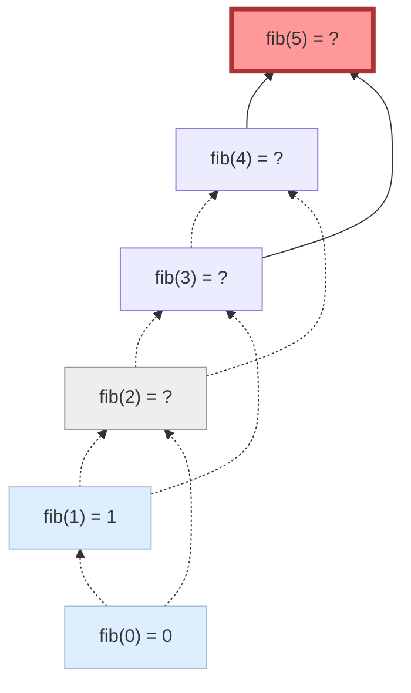

在实现类似动态规划算法时，你可以选择递推和递归中更方便实现的一种方式。

### 递推

递推的方式是自底至上的。我们需要按照依赖的拓扑序，每次找到一个可以计算的状态，并计算出这个状态的值。

我们以斐波那契数列为例。斐波那契数列的递推实现如下：

```cpp
int f[N];
int fib(int x) {
    f[0] = 0; f[1] = 1;
    for (int i = 2; i <= x; i++) {
        f[i] = f[i - 1] + f[i - 2];
    }
    return f[x];
}
```

递推的优势在于计算效率高，方便优化，适合拓扑序很显著的情况：

- 例如在斐波那契数列里，$1 \dots n$ 的顺序是非常清晰的；
- 在 Bellman-Ford, Floyd-Warshall 和背包里，递推的方式有助于简化状态。


### 递推（记忆化搜索）

递归的方式是自顶之下的。我们从答案需要的状态出发，在需要时递归计算所需的子状态。

对于斐波那契数列来说，最简单的代码是这样的：

```cpp
int fib(int x) {
    if (x <= 1) return x;
    return fib(x - 1) + fib(x - 2);
}
```

但是复杂度会达到指数级。因此，我们需要在递归里面使用 *记忆化*。注意到，一个状态的取值只和状态本身有关（这是一个 *纯函数* ），因此多次计算同一个状态的值是一样的。我们可以在第一次计算后，将结果保存下来。这样，总共需要计算的状态数也就是总的状态数。

```cpp
int f[N]; // initialize : -1 for not computed
int fib(int x) {
    if (x <= 1) return x;
    if (f[x] != -1) return f[x];
    return f[x] = fib(x - 1) + fib(x - 2);
}
```

递归的好处是：只要你知道拓扑序存在，你就不需要显式设计出循环顺序来，而是直接用 DFS 的方式求出了一个拓扑序，隐式地把顺序搞定了。同时，你也只需要计算所有和答案相关的状态：这有点像是我们推迟了某些状态的求值，而无关的求值直接被忽略掉了。

<center>

</center>

在状态相对复杂而转移相对清晰时，记忆化搜索能更方便地实现。当然，由于递归本身是有代价的，在某些情况下效率可能不如递推。

