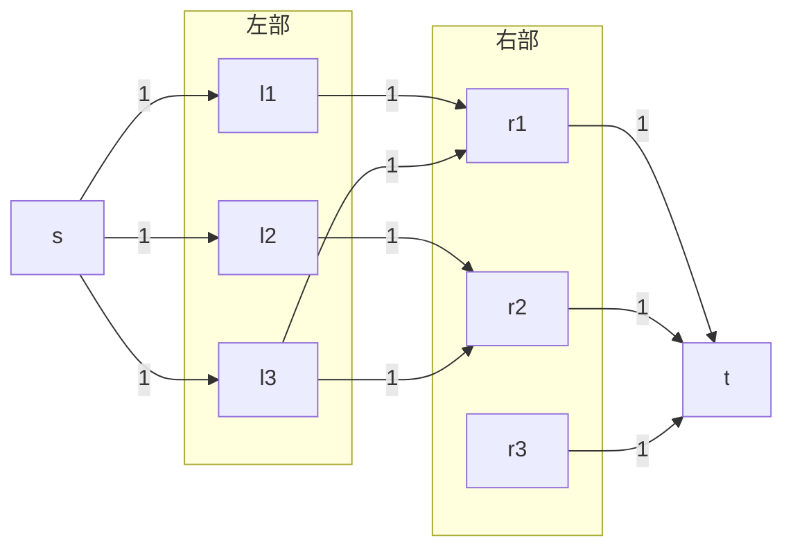
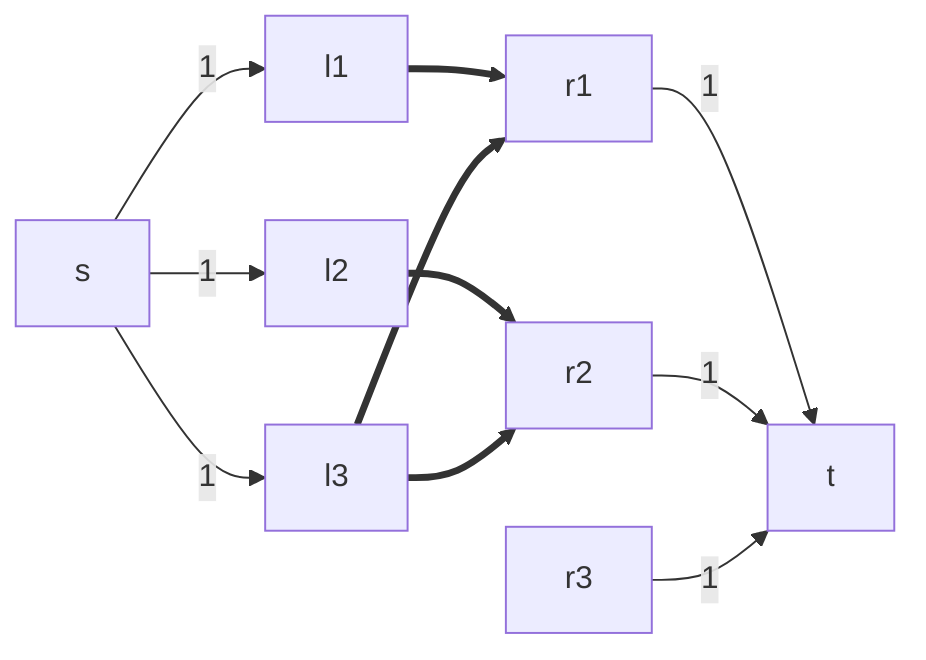
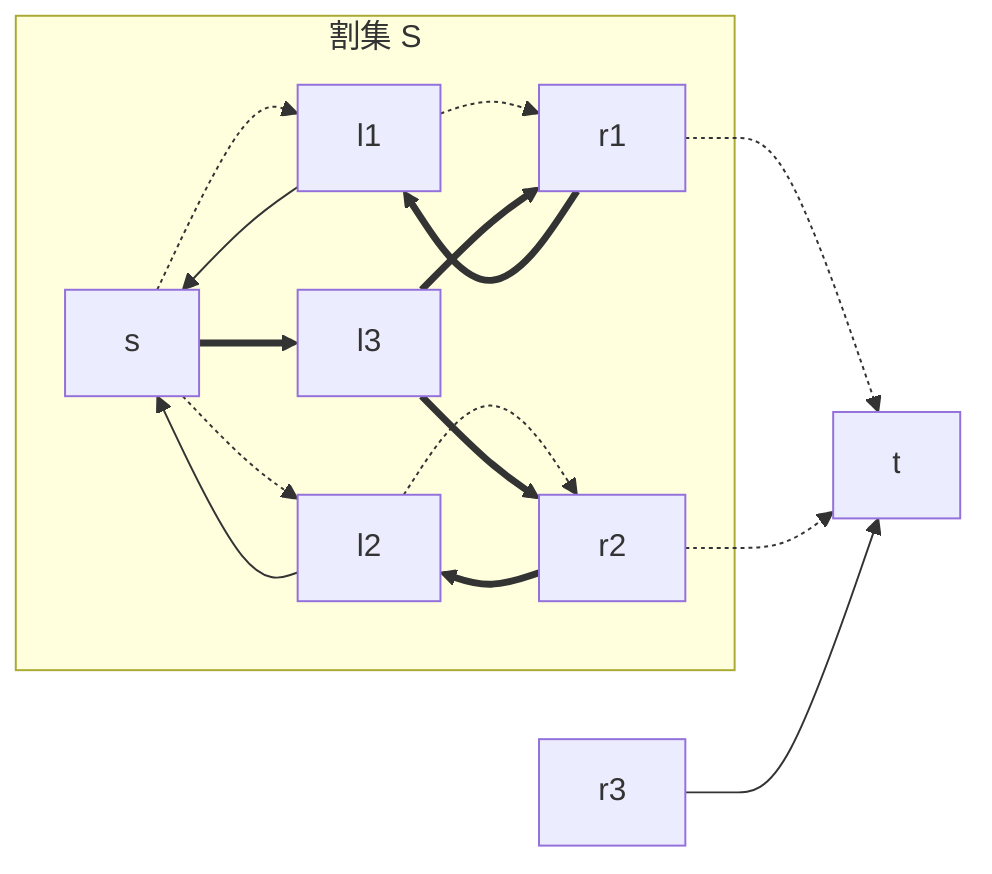
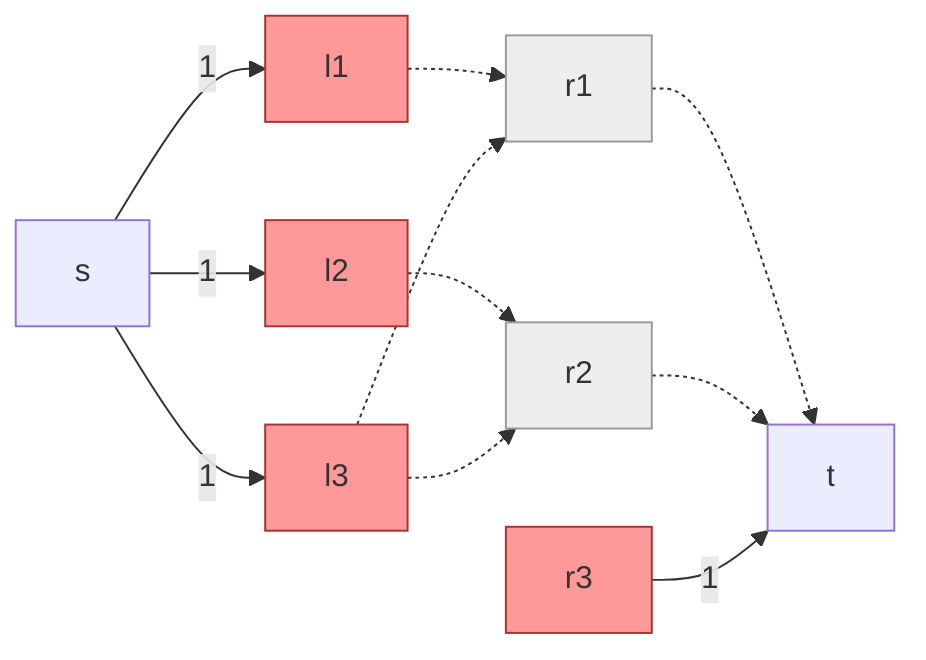

### 二分图转最大流
<center>

</center>

### 二分图上最大流复杂度分析

#### Ford-Fulkerson

因为只有至多 $V / 2$ 个匹配，所以至多增广 $O(V)$ 次；每次使用 $O(E)$ 的 DFS。 因此总复杂度为 $O(VE)$。

一个在中文算法竞赛语境下的「匈牙利」算法[^1]，本质是 Ford-Fulkerson。

[^1]: 真正的 [匈牙利算法](https://en.wikipedia.org/wiki/Hungarian_algorithm) 是求最大权匹配的，也叫 KM 算法。

#### Dinic

考虑原版 Dinic 的分析：

* 至多增广 $O(V)$ 次，每次使用 $O(VE)$ 寻找阻塞流，总复杂度 $O(V ^ 2 E)$。 

但在二分图下，我们可以证明：

* 至多增广 $O(\sqrt{V})$ 次，每次使用 $O(E)$ 寻找阻塞流，因此总复杂度通常写为 $O(\sqrt{V} E)$。 

该性质来源于单位流量图的特殊性质，你将在作业（或者作业 bonus）中证明这一性质。

二分图上的 Dinic 算法被称为 [Hopcroft-Karp](https://en.wikipedia.org/wiki/Hopcroft%E2%80%93Karp_algorithm)：Hopcroft 是交大的老朋友 John Hopcroft 教授。

### 二分图流图上的最小割

正如求出二分图流图上的最大流即最大匹配，在二分图流图上求出最小割也即求出了最小点覆盖。

!!! info "最大流 = 最大匹配 = 最小割 = 最小点覆盖 = $n$ - 最大独立集"
    
    <center>
    ```mermaid
    %%{ init: { 'flowchart': { 'curve': 'linear' } } }%%
    flowchart LR
        subgraph 二分图
        最大匹配 ----|König 定理| 最小点覆盖
        end
        subgraph 网络流
        最大流 ----|最大流-最小割定理| 最小割
        end
        二分图 --->|即是| 网络流
    ```
    </center>

#### 点覆盖

一个点集 $F$ 是图的点覆盖，指的是能够使得每条边的端点被至少选择一次的点集。

$$ \forall (u, v) \in F, u \in F \lor v \in F.$$

#### 独立集

一个点集 $I$ 被称为是独立集，指的是没有相邻点的点集。

$$ \forall (u, v) \in I, u \notin I \lor v \notin I.$$

#### 独立集 = 点覆盖的补集

任何一个独立集 $I$ 的补集 $V \setminus I$ 一定是点覆盖：独立集每条边至多有一个顶点被选中，因此补集中每条边至少有一个点被覆盖。


#### 最小割 = 最小点覆盖

考虑一个二分图流图。特别地，我们要求割不能割在中间的边：由于最终求出的所有流一定是 $s\rightarrow l \rightarrow r \rightarrow t$ 的形式，我们等价于割掉了一个左部或者右部的顶点。
我们可以令中间的容量为 $+\infty$ 来显式表示这一要求[^2]：
[^2]: 事实上，分析流图性质可以发现，即使全 $1$，从 $s$ 出发求连通块作为割集也必然满足这个性质。

<center>

</center>

这个流图的最大流仍然代表了一组匹配，且复杂度分析将和权值为 $1$ 时一致。


例如，如果我们选择最大匹配 $(l_1, r_1), (l_2, r_2)$，此时求出的割集如下，虚线表示有流量经过的边，标粗边为 DFS 连通性示意。

<center>

</center>

被割集跨过的边为 $(r_1, t), (r_2, t)$；或者我们可以等价看做割掉了 $r_1, r_2$ 两个顶点：删掉这两个点，原图不存在任何一个匹配。

<center>

</center>

这样，我们用最小割求出了一组最小点覆盖 $\{r_1, r_2\}$，与其对应的最大独立集是 $V \setminus \{r_1, r_2\}$。

这个做法求最小点覆盖的优点是：我们不需要去讨论增广路的性质，构造性地给出解；而是直接用另一种解释来巧妙计算了我们需要的结果。
