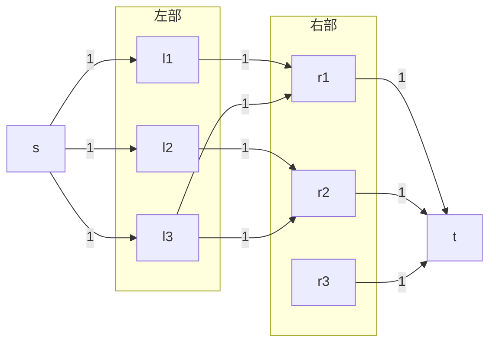
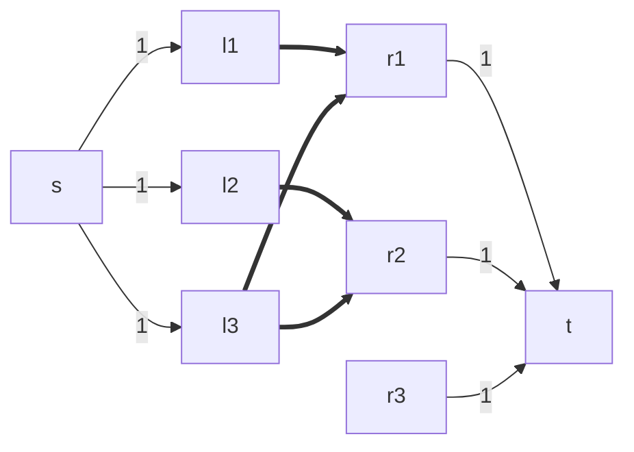
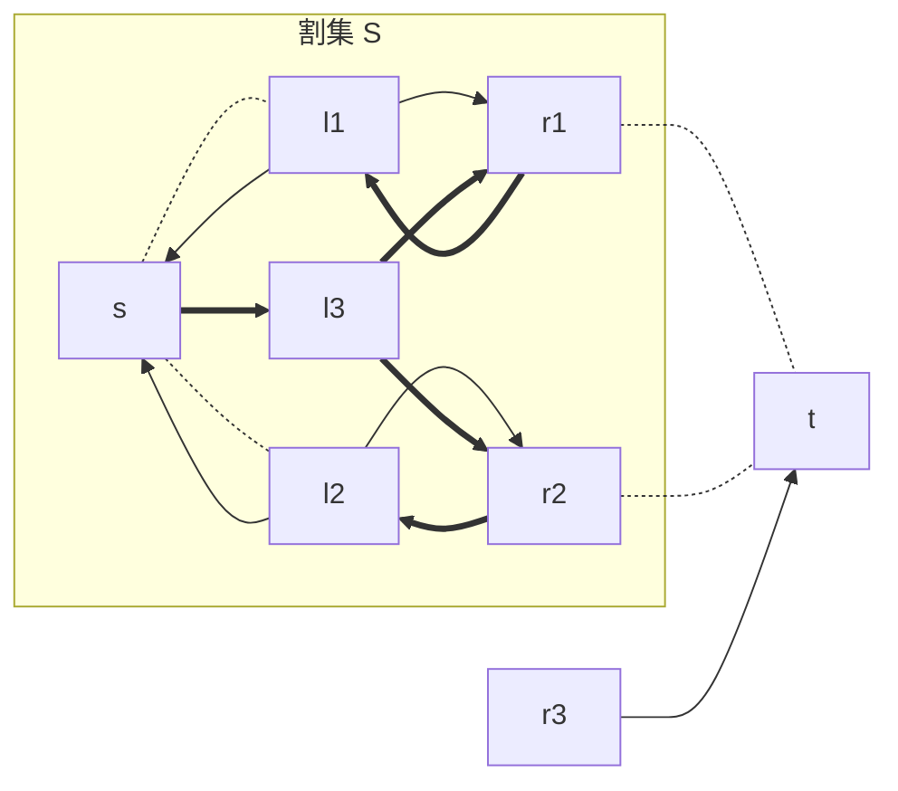
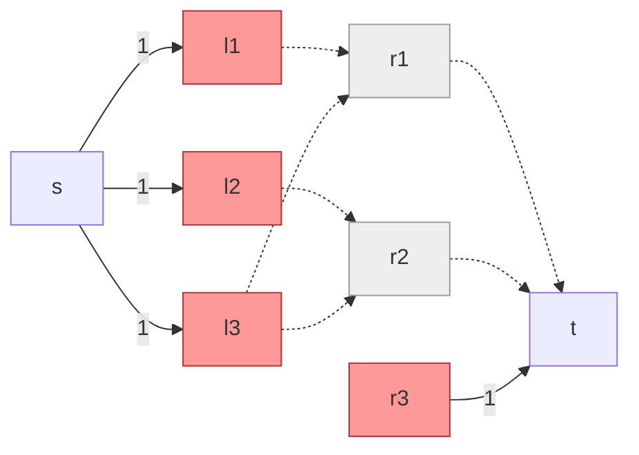

### 二分图转最大流



### 二分图上最大流复杂度分析

#### Ford-Fulkerson

因为只有至多 $V / 2$ 个匹配，所以至多增广 $O(V)$ 次；每次使用 $O(E)$ 的 DFS。 因此总复杂度为 $O(VE)$。

一个在中文算法竞赛语境下的「匈牙利」算法[^1]，本质是 Ford-Fulkerson。

[^1]: 真正的 [匈牙利算法](https://en.wikipedia.org/wiki/Hungarian_algorithm) 是求最大权匹配的，也叫 KM 算法。

#### Dinic

考虑原版 Dinic 的分析：

* 至多增广 $O(V)$ 次，每次使用 $O(VE)$ 寻找阻塞流，总复杂度 $O(V ^ 2 E)$。 

但在二分图下，我们可以证明：

* 至多增广 $O(\sqrt{V})$ 次，每次使用 $O(E)$ 寻找阻塞流，因此总复杂度通常写为 $O(\sqrt{V} E)$。 

该性质来源于单位流量图的特殊性质，你将在作业（或者作业 bonus）中证明这一性质。

二分图上的 Dinic 算法被称为 [Hopcroft-Karp](https://en.wikipedia.org/wiki/Hopcroft%E2%80%93Karp_algorithm)：Hopcroft 是交大的老朋友 John Hopcroft 教授。

### 二分图流图上的最小割

在网络流中，最大流 = 最小割。在二分流图中，最小割也有特殊的含义。

事实上，二分图上有很多特殊的对偶性质，我们将介绍其最小点覆盖，最大独立集，以及与最小割的关系。

#### 点覆盖

一个图的点覆盖，指的是能够使得每条边的端点被至少选择一次的点集。

#### 独立集

一个图的独立集，指的是没有相邻点的点集。

!!! info "最大流 = 最大匹配 = 最小割 = 最小点覆盖 = $n$ - 最大独立集"

    第一个等号：König 定理。

    第二个等号：每个点覆盖 $C$ 的补集 $V \setminus C$ 都是独立集，反之亦然。

    <center>
    ```mermaid
    %%{ init: { 'flowchart': { 'curve': 'linear' } } }%%
    flowchart LR
        subgraph 二分图
        最大匹配 ----|König 定理| 最小点覆盖
        end
        subgraph 网络流
        最大流 ----|最大流-最小割定理| 最小割
        end
        网络流 --->|推出| 二分图
    ```
    </center>

#### 最小割 = 最小点覆盖

正如求出二分图流图上的最大流即最大匹配，在二分图流图上求出最小割也即求出了最小点覆盖。

考虑一个二分图流图。特别地，我们要求割不能割在左部到右部的边，即令中间的权值为 $+\infty$。



对这个流图求最大流，我们仍然能得到一组匹配，且复杂度分析将和权值为 $1$ 时一致。此时，我们的观察最小割的边一定在左侧或者右侧，等价于割掉了一个左部或者右部的顶点。
（事实上，无需令中间为 $+\infty$，按照从 $s$ 出发也能求出这样的割集）

例如，如果我们选择最大匹配 $(l_1, r_1), (l_2, r_2)$，此时求出的割集如下，标粗边为 DFS 连通性示意。



此时，被割集跨过的边为 $(r_1, t), (r_2, t)$；或者我们可以等价看做割掉了 $r_1, r_2$ 两个顶点，也即删掉这两个点，原图不存在任何一个匹配。



因此，我们用最小割求出了一组最小点覆盖 $\{r_1, r_2\}$，与其对应的最大独立集是 $V \setminus \{r_1, r_2\}$。

这个做法求最小点覆盖的优点是：我们不需要去讨论增广路的性质，构造性地给出解；而是直接用另一种解释来巧妙计算了我们需要的结果。