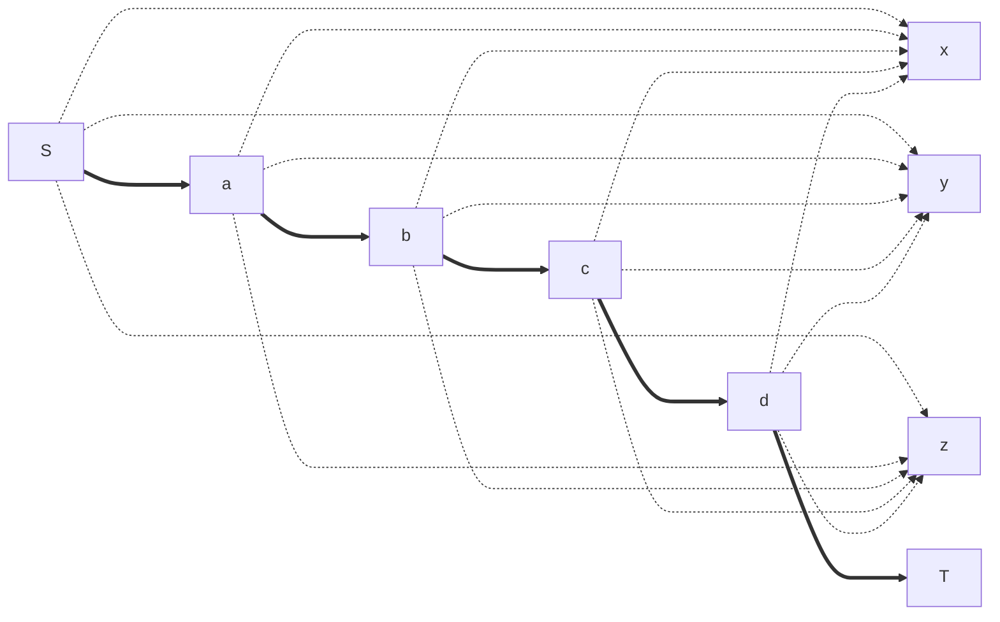
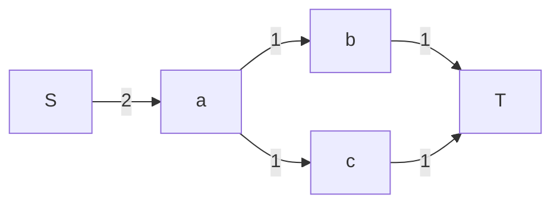

无论是哪一种网络流算法，都需要搜索增广路并更新残量网络。搜索通常有两种，一种是 DFS，另一种是 BFS。

### 使用 DFS 寻找增广路

如果我们从起点 $S$ 出发，那么当 DFS 到 $T$ 的时候，此时运行栈里恰好就是一整条路径，因此在返回时一层一层返回更新就好了。

以下我们用伪代码写出这个过程。

```python
int dfs(u, flow):
    if u == T:
        return flow
    for e in E[u]:
        if e has flow and visiting e.to could be useful:
            used = dfs(e.to, min(flow, e.flow))
            if used > 0:
                e.flow -= used
                reverse(e).flow += used
                return used
    return 0
```
!!! question "什么时候访问是「有用的」？"

    在上述例子里，我们可以发现：每个点只应该被访问一次。因为，如果 dfs 走到了 `return 0`，那么意味着目前 $u$ 不可能对答案做出贡献了。 

    因此，你应当实现一个标记数组，来判断每个点是否被访问过。如果不这么做的话，可能会对于下面的图变为指数复杂度。   


    ```mermaid
    graph LR
        S -->|1| a
        S & a -->|1| b
        a & b -->|1| c
        b & c -->|1| d
        c & d -->|1| e
        d & e -->|....| z
        z -->|0| T
    ```

### 使用 BFS 寻找增广路

在使用 BFS 以及类似的使用队列的方法时，我们需要额外记录前驱边，也即 BFS 树到上层的边。在 BFS 完成后，我们从 $T$ 开始通过前驱来反向恢复整条路径。

```python
if bfs(S) reaches T:
    x = T
    # first : get the bottleneck flow
    flow = +inf
    while x != S:
        e = pre[x] # x = e.to
        flow = min(flow, e.flow)
        x = reverse(e).to
    # second : update residual network
    x = T
    while x != S:
        e = pre[x]
        e.flow -= flow
        reverse(e).flow += flow
        x = reverse(e).to
```

### Dinic: 在 DAG 上 O(VE) 寻找阻塞流

回忆 Dinic 算法的复杂度 $O(V^2 E)$：

* 需要至多 $O(V)$ 增广；
* 每轮增广，我们 DFS 找到一组阻塞流的耗时是 $O(VE)$ 的，其中：
    * 每次搜索至多使用 $O(V)$ 的时间；
    * 每次搜索结束后会移除掉一条边，因此至多进行 $O(E)$ 次增广。

这样的分析总体来看是没问题的，但是请仔细看这个 DFS 的过程：实现每一步的复杂度并不是非常直接的事情。

* 每一轮里，DFS 需要保证不经过重复点，否则复杂度会上升到指数。
* 即使每次都删掉了阻塞边，直接实现 DFS 仍然会让复杂度达到 $O(V + E)$，从而总复杂度上升到 $O(V E ^ 2)$：因此，某些 *不需要* 的边需要被删掉或者跳过。

为了保证总复杂度正确，我们需要在 $O(VE)$ 的时间内找到一组阻塞流。因此，我们接下来介绍两个优化，其中一个保证了 $O(VE)$ 的复杂度，另一个在实践中提升了运行效率。

#### 当前弧优化

首先，我们先用一个例子展示一下直接实现 DFS 仍然会让复杂度达到 $O(V + E)$ 的原因。



如图，为了找到一条 $S$ 到 $T$ 的路，即使 $x, y, z$ 可能会被标记为访问过，但是指向他们的边仍然会被访问，这导致复杂度变成了 $O(V + E)$。

观察可得，这些无用边在这个 DAG 上是不可能更新答案的，因此我们需要用一种方法来表示这件事。

!!! info "当前弧优化"

    记录下每个点访问的最后一条出边。在之后访问时，从这条边开始。

在当前弧优化里，我们如何体现跳过无用边的呢？这是因为，如果 DFS 出发得到 $0$，那么我们就会跳过这条边。在一次寻找阻塞流的时候，每条边都至多触发一次这样的更新，因此 $O(E)$ 会均摊在总复杂度上，这样时间就对了。

更精细的讨论可能可以优化常数项：比如，一条边如果没有耗完当前节点的所有流量，那么这条边能到达的点里一定没有 $T$ 了，所以应当跳过。当然，这不影响复杂度分析。

#### 多路增广

注意到，每次从头开始寻找增广路并不必要：如下图中，我们更新完 $S\rightarrow a \rightarrow b \rightarrow T$ 后返回到 $a$ 时，仍然有 $1$ 的流量没有用完；回退到起点再按照同样的路径 DFS 到 $a$，流量仍然将会是 $1$。



!!! info "多路增广"
    在递归返回时，如果流量没有耗尽，继续 DFS。

这样并不会降低复杂度的阶，但是在运行时间上是严格小于单路增广的，而且实现起来也很自然。

以下是使用数组存边实现的 Dinic DFS 增广的代码片段。

```cpp
int cur[N]; 
int dfs(int x, int flow) {
    if (x == sink) return flow;
    int used = 0;
    for (int &i = cur[x]; i != 0; i = e[i].next) { // i : reference to cur[x]
        if (e[i].flow > 0 && level[x] + 1 == level[e[i].to]) {
            int ret = dfs(e[i].to, min(e[i].flow, flow - used));
            if (ret) {
                used += ret;
                e[i].flow -= ret;
                e[i ^ 1].flow += ret;
                if (used == flow) break;
                // NOTE: if not break,
                // the current flow optimization is broken,
                // since current edge is still useful
            }
        }
    }
    return used;
}
int dinic() {
    int ans = 0;
    while (make_level()) {
        for (int i = 1; i <= n; i++) { // initialize cur[]
            cur[i] = list_head[i];
        }
        ans += dfs(source, INF); // dfs ONCE with inf flow
    }
    return ans;
}
```