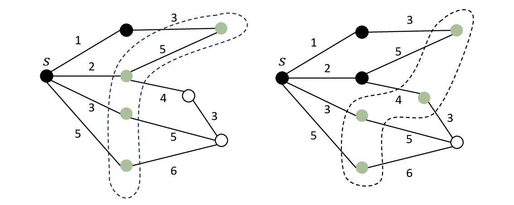
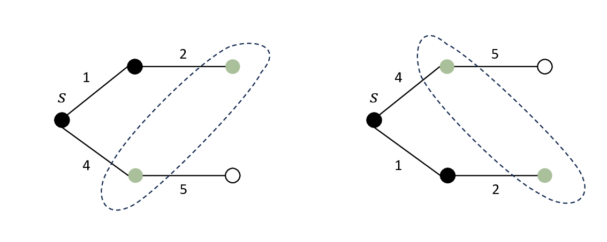

### [1985. A Way Out](https://acm.sjtu.edu.cn/OnlineJudge/problem/1985)

给定一张标号为 $1$ 到 $n$ 的有向图，请找到一条从 $s$ 到 $t$ 的简单路。简单路定义：不存在重复的点与边。

* 数据范围：$n \leq 1000, m \leq 10^4$

??? Solution

    === "C++ (BFS)"
        ```cpp
        vector <int> find_path(int n, int s, int t, vector < pair <int, int> >& edges) {
            vector <vector <int>> E(n + 1);
            for (auto [u, v] : edges) {
                E[u].push_back(v);
            }
            queue <int> q;
            vector <int> parent(n + 1, -1);
            q.push(s);
            parent[s] = 0; // root
            while (!q.empty()) {
                int u = q.front();
                q.pop();
                if (u == t) {
                    vector <int> path;
                    for (int i = t; i; i = parent[i]) path.push_back(i);
                    reverse(path.begin(), path.end());
                    return path;
                }
                for (int v : E[u]) {
                    if (parent[v] == -1) {
                        parent[v] = u;
                        q.push(v);
                    }
                }
            }
            return {};
        }
        ```
    === "C++ (DFS)"
        ```cpp
        vector <vector <int>> E;
        vector <int> path;
        vector <int> visited;

        bool dfs (int u, int t) {
            path.push_back(u);
            visited[u] = 1;
            if (u == t) return true;
            for (auto v : E[u]) {
                if (!visited[v]) {
                    if (dfs(v, t)) return true;
                }
            }
            path.pop_back();
            return false;
        }

        vector <int> find_path(int n, int s, int t, vector < pair <int, int> >& edges) {
            path.clear();
            E.assign(n + 1, {});
            visited.assign(n + 1, 0);
            for (auto [u, v] : edges) {
                E[u].push_back(v);
            }
            if (dfs (s, t)) return path;
            return {};
        }
        ```
    === "C++ (Bellman-Ford)"
        ```cpp
        vector <int> find_path(int n, int s, int t, vector < pair <int, int> >& edges) {
            vector <int> parent(n + 1, -1);
            parent[s] = 0;
            for (int _ = 0; _ < n - 1 && parent[t] == -1; _++)
                for (auto& [u, v] : edges)
                    if (parent[v] == -1 && parent[u] != -1)
                        parent[v] = u;
            if (parent[t] == -1) return {};
            vector <int> path;
            for (int i = t; i; i = parent[i]) path.push_back(i);
            reverse(path.begin(), path.end());
            return path;
        }
        ```

    === "Python (BFS)"
        ```python
        from collections import deque
        def find_path(n, s, t, edges):
            E = [[] for _ in range(n + 1)]
            for u, v in edges:
                E[u].append(v)
            q = deque([s])
            parent = [-1] * (n + 1)
            parent[s] = 0  # root
            while q:
                u = q.popleft()
                if u == t:
                    path = []
                    while u:
                        path.append(u)
                        u = parent[u]
                    return path[::-1]
                for v in E[u]:
                    if parent[v] == -1:
                        parent[v] = u
                        q.append(v)
            return []
        ```

    === "Python (DFS)"
        ```python
        def find_path(n, s, t, edges):
            E = [[] for _ in range(n + 1)]
            for u, v in edges:
                E[u].append(v)
            path = []
            visited = [0] * (n + 1)

            def dfs(u):
                path.append(u)
                visited[u] = 1
                if u == t:
                    return True
                for v in E[u]:
                    if not visited[v]:
                        if dfs(v):
                            return True
                path.pop()
                return False

            if dfs(s):
                return path
            return []
        ```
    === "Python (Bellman-Ford)"
        ```python
        def find_path(n, s, t, edges):
            parent = [-1] * (n + 1)
            parent[s] = 0
            for _ in range(n - 1):
                for u, v in edges:
                    if parent[v] == -1 and parent[u] != -1:
                        parent[v] = u
            if parent[t] == -1:
                return []
            path = []
            while t:
                path.append(t)
                t = parent[t]
            return path[::-1]
        ```


### [2466. A Way Out, Interactively](https://acm.sjtu.edu.cn/OnlineJudge/problem/2466)

**这是一道交互题。** 有一张由 $n$ 个点构成的无向图。最开始你在 $1$ 号点，你的目标是走到 $n$ 号点。在每一步，你可以走到一个邻居点并获取这个点的邻居信息。你可以在最多 $2n$ 次操作内走到 $n$ 号点，或者判断不可能走到。

* 数据范围：$2 \leq n \leq 100$

??? Solution

    与非交互版本不同之处在于，你需要维护当前的位置，且不能跳到之前访问过的任意点。因此你不能使用 BFS，而是需要使用 DFS。由于一个点最多出入一次，模拟 DFS 的移动过程即可满足要求。

    !!! warning "我在哪？"
        
        由于需要明确地返回当前节点，因此你需要在每次 DFS 访问完一个点后，输出当前点编号并输入（其实已经知道的） 01 串。
    
    === "C++"
        ```cpp
        #include <bits/stdc++.h>
        using namespace std;

        int n;
        vector <int> vis;
        void dfs (int x) {
            vis[x] = 1;
            if (x == n) {
                cout << "yes" << endl;
                exit(0);
            }
            string s;
            cin >> s;
            for (int i = 1; i <= n; i++) {
                if (s[i - 1] == '1' && !vis[i]) {
                    cout << i << endl; // x -> i
                    dfs(i);
                    cout << x << endl; // i -> x
                    cin >> s; // to consume the input
                }
            }
        }

        int main() {
            cin >> n;
            vis.assign(n + 1, 0);
            dfs (1);
            cout << "no" << endl;
        }
        ```
    === "Python"
        ```python
        n = int(input())
        vis = [0] * n

        def dfs(x):
            global vis
            vis[x] = 1
            if x == n - 1:
                print("yes", flush=True)
                exit(0)
            s = input()
            for i in range(n):
                if s[i] == '1' and not vis[i]:
                    print(i + 1, flush=True)
                    dfs(i)
                    print(x + 1, flush=True)
                    input()

        dfs(0)
        print("no", flush=True)
        ```


### [1342. Shortest Path](https://acm.sjtu.edu.cn/OnlineJudge/problem/1342)

给定一个 $n$ 个点 $m$ 条边的无向图，求 $s$ 到 $t$ 的最短路的长度。

* 数据范围：$1 \leq n \leq 2500$, $1 \leq m \leq 6200$, $0 \leq w_i \leq 10^9$

??? Solution

    请参考 [最短路](sssp.md) 章节。

    === "C++ (Bellman-Ford)"
        ```cpp
        #include <bits/stdc++.h>
        using namespace std;
        const int64_t INF = 1e18;

        int main() {
            int n, m, s, t;
            cin >> n >> m >> s >> t;
            vector <array <int, 3>> edges;
            for (int i = 0; i < m; i++) {
                int u, v, w;
                cin >> u >> v >> w;
                edges.push_back({u, v, w});
            }
            vector <int64_t> dis(n + 1, INF);
            dis[s] = 0;
            for (int i = 0; i < n - 1; i++) {
                for (auto [u, v, w] : edges) {
                    dis[v] = min(dis[v], dis[u] + w);
                    dis[u] = min(dis[u], dis[v] + w);
                }
            }
            cout << dis[t] << endl;
        }
        ```
    === "C++ (Dijkstra)"
        ```cpp
        #include <bits/stdc++.h>
        using namespace std;
        const int64_t INF = 1e18;

        int main() {
            int n, m, s, t;
            cin >> n >> m >> s >> t;
            vector <vector <pair <int, int>>> E(n + 1);
            for (int i = 0; i < m; i++) {
                int u, v, w;
                cin >> u >> v >> w;
                E[u].push_back({v, w});
                E[v].push_back({u, w});
            }
            vector <int64_t> dis(n + 1, INF);
            vector <int> visited(n + 1, 0);
            dis[s] = 0;
            for (int i = 0; i < n; i++) {
                int u = 0;
                for (int j = 1; j <= n; j++)
                    if (!visited[j] && dis[j] < dis[u])
                        u = j;
                if (dis[u] == INF) break;
                visited[u] = 1;
                for (auto [v, w] : E[u]) dis[v] = min(dis[v], dis[u] + w);
            }
            cout << dis[t] << endl;
        }
        ```
    === "C++ (Dijkstra + priority_queue)"
        ```cpp
        #include <bits/stdc++.h>
        using namespace std;
        const int64_t INF = 1e18;

        int main() {
            int n, m, s, t;
            cin >> n >> m >> s >> t;
            vector <vector <pair <int, int>>> E(n + 1);
            for (int i = 0; i < m; i++) {
                int u, v, w;
                cin >> u >> v >> w;
                E[u].push_back({v, w});
                E[v].push_back({u, w});
            }
            vector <int64_t> dis(n + 1, INF);
            priority_queue <pair <int64_t, int>,
                            vector <pair <int64_t, int>>,
                            greater <pair <int64_t, int>>> pq;
            dis[s] = 0;
            pq.push({0, s});
            while (!pq.empty()) {
                auto [d, u] = pq.top();
                pq.pop();
                if (d > dis[u]) continue;
                for (auto [v, w] : E[u]) {
                    if (dis[v] > d + w) {
                        dis[v] = d + w;
                        pq.push({dis[v], v});
                    }
                }
            } 
            cout << dis[t] << endl;
        }
        ```
    === "Python (Bellman-Ford)"
        ```python
        INF = 10 ** 18
        n, m, s, t = map(int, input().split())
        edges = [tuple(map(int, input().split())) for _ in range(m)]
        dis = [INF] * (n + 1)
        dis[s] = 0
        for _ in range(n - 1):
            for u, v, w in edges:
                dis[v] = min(dis[v], dis[u] + w)
                dis[u] = min(dis[u], dis[v] + w)
        print(dis[t])
        ```
    === "Python (Dijkstra)"
        ```python
        INF = 10 ** 18
        n, m, s, t = map(int, input().split())
        E = [[] for _ in range(n + 1)]
        for _ in range(m):
            u, v, w = map(int, input().split())
            E[u].append((v, w))
            E[v].append((u, w))

        dis = [INF] * (n + 1)
        visited = [0] * (n + 1)
        dis[s] = 0
        for _ in range(n):
            u = min((i for i in range(1, n + 1) if not visited[i]), key=lambda x: dis[x])
            if dis[u] == INF:
                break
            visited[u] = 1
            for v, w in E[u]:
                dis[v] = min(dis[v], dis[u] + w)
        print(dis[t])
        ```
    === "Python (Dijkstra + heapq)"
        ```python
        import heapq
        INF = 10 ** 18
        n, m, s, t = map(int, input().split())
        E = [[] for _ in range(n + 1)]
        for _ in range(m):
            u, v, w = map(int, input().split())
            E[u].append((v, w))
            E[v].append((u, w))

        dis = [INF] * (n + 1)
        dis[s] = 0
        pq = [(0, s)]
        while pq:
            d, u = heapq.heappop(pq)
            if d > dis[u]:
                continue
            for v, w in E[u]:
                if dis[v] > d + w:
                    dis[v] = d + w
                    heapq.heappush(pq, (dis[v], v))
        print(dis[t])
        ```


### [1343. 0-1 Shortest path](https://acm.sjtu.edu.cn/OnlineJudge/problem/1343)

给定一个 $n$ 个点 $m$ 条边的无向图，求 $s$ 到 $t$ 的最短路的长度。

* 数据范围：$1 \leq n, m \leq 10^6$, $0 \leq w_i \leq 1$

??? Solution

    先考虑只有 $1$ 边权的情况，此时就是 BFS 问题。BFS 过程中使用了一个队列来维护即将访问的点，队列里的元素的距离非递减，且队首和队尾的元素差至多为 $1$。因此，事实上我们可以把 BFS 看做 Dijkstra 的一个特例：因为队列实际上维护了一个优先队列。

    对于 $0$ 边权，我们可以修改 BFS 的过程，使用双端队列来维护队列的单调性：在将 $0$ 权点加入队列时，放在队首；在将 $1$ 权点加入队列时，放在队尾。这样，我们就在线性的时间内完成了 $0-1$ 最短路。
    
    === "C++"
        ```cpp
        #include <bits/stdc++.h>
        using namespace std;
        const int64_t INF = 1e18;

        int main() {
            int n, m, s, t;
            cin >> n >> m >> s >> t;
            vector <vector <pair <int, int>>> E(n + 1);
            for (int i = 0; i < m; i++) {
                int u, v, w;
                cin >> u >> v >> w;
                E[u].push_back({v, w});
                E[v].push_back({u, w});
            }
            vector <int64_t> dis(n + 1, INF);
            deque <int> q;
            dis[s] = 0;
            q.push_back(s);
            while (!q.empty()) {
                int u = q.front();
                q.pop_front(); // Pop at most twice for each vertex
                for (auto [v, w] : E[u]) {
                    if (dis[v] > dis[u] + w) {
                        dis[v] = dis[u] + w;
                        if (w == 0) q.push_front(v);
                        else q.push_back(v);
                    }
                }
            }
            cout << dis[t] << endl;
        }
        ```

### [1340. Strongly Connected](https://acm.sjtu.edu.cn/OnlineJudge/problem/1340)

给定一张 $n$ 个点，$m$ 条边的有向图，询问有多少对点 $(u, v)$ 满足：

1. 存在一条从 $u$ 到 $v$ 的路径；
2. 存在一条从 $v$ 到 $u$ 的路径；
3. $u < v$。

* 数据范围：$1 \leq n, m \leq 10^5$

??? Solution

    强连通分量内的点两两可达，因此求出每一个强连通分量的大小 $k_i$，答案即为 $\sum_{i=1}^{c} \frac{k_i(k_i - 1)}{2}$。

    === "C++"
        ```cpp
        #include <bits/stdc++.h>
        using namespace std;

        void dfs(int u, vector <vector <int>> &e, vector <int> &comp, vector <int> &vis) {
            vis[u] = 1;
            for (auto v : e[u]) if (!vis[v]) dfs(v, e, comp, vis);
            comp.push_back(u);
        }

        int main() {
            int n, m;
            cin >> n >> m;
            vector <vector <int>> G(n + 1), H(n + 1);
            for (int i = 0; i < m; i++) {
                int u, v;
                cin >> u >> v;
                G[u].push_back(v);
                H[v].push_back(u);
            }
            
            // first DFS: find the order of finishing times
            vector <int> order, vis;
            vis.assign(n + 1, 0);
            for (int u = 1; u <= n; u++) if (!vis[u]) dfs(u, G, order, vis);
            reverse(order.begin(), order.end());
            
            // second DFS: find the SCCs on reversed graph
            vis.assign(n + 1, 0);
            int64_t ans = 0;
            for (auto u : order) if (!vis[u]) {
                vector <int> component;
                dfs (u, H, component, vis);
                ans += 1ll * component.size() * (component.size() - 1) / 2;
            }
            cout << ans << endl;
        }
        ```
    === "Python"
        Python 需要用 `sys.setrecursionlimit` 来增加递归深度限制。

        ```python
        from sys import setrecursionlimit
        setrecursionlimit(10 ** 6)

        def dfs(u, e, comp, vis):
            vis[u] = True
            for v in e[u]:
                if not vis[v]:
                    dfs(v, e, comp, vis)
            comp.append(u)

        n, m = map(int, input().split())
        G = [[] for _ in range(n + 1)]
        H = [[] for _ in range(n + 1)]
        for _ in range(m):
            u, v = map(int, input().split())
            G[u].append(v)
            H[v].append(u)

        # first DFS: find the order of finishing times
        order = []
        vis = [False] * (n + 1)
        for u in range(1, n + 1):
            if not vis[u]:
                dfs(u, G, order, vis)
        order = order[::-1]

        # second DFS: find the SCCs on reversed graph
        vis = [False] * (n + 1)
        ans = 0
        for u in order:
            if not vis[u]:
                component = []
                dfs(u, H, component, vis)
                ans += len(component) * (len(component) - 1) // 2
        print(ans)
        ```


### [1341. 2-SAT](https://acm.sjtu.edu.cn/OnlineJudge/problem/1341)

判断是否存在一组变量满足一系列形如 $(x_i=a) \lor (x_j=b)$ 的约束，其中 $a,b\in \{0,1\}$，并输出一组解（如果存在）。

* 数据范围：$1 \leq n, m \leq 10^6$

??? Solution

    请见 [2-SAT](2sat.md) 章节。

    === "C++"
        ```cpp
        #include <bits/stdc++.h>
        using namespace std;

        struct Solver {
            int n;
            vector <vector <int>> G, H;
            Solver (int _n) : n(_n) {
                G.resize(2 * n);
                H.resize(2 * n);
            }
            void add_edge(int u, int v) {
                G[u].push_back(v);
                H[v].push_back(u);
            }
            void add(int u, int x, int v, int y) {
                add_edge(u * 2 + (!x), v * 2 + y);
                add_edge(v * 2 + (!y), u * 2 + x);
            }
            void dfs(int u, vector <vector <int>> &e, vector <int> &comp, vector <int> &vis) {
                vis[u] = 1;
                for (auto v : e[u]) if (!vis[v]) dfs(v, e, comp, vis);
                comp.push_back(u);
            }
            vector <int> solve() {
                vector <int> order, vis;
                vis.assign(2 * n, 0);
                for (int u = 0; u < 2 * n; u++) if (!vis[u]) dfs(u, G, order, vis);
                reverse(order.begin(), order.end());
                
                vis.assign(2 * n, 0);
                vector <int> belong(2 * n);
                int scc = 0;
                for (auto u : order) if (!vis[u]) {
                    vector <int> component;
                    dfs (u, H, component, vis);
                    ++scc;
                    for (auto v : component) belong[v] = scc;
                }

                vector <int> ans(n);
                for (int i = 0; i < n; i++) {
                    if (belong[i * 2] == belong[i * 2 + 1]) {
                        return {};
                    } else {
                        ans[i] = belong[i * 2] < belong[i * 2 + 1];
                    }
                }
                return ans;
            }
        };

        int main() {
            int n, m;
            cin >> n >> m;
            Solver solver(n);
            for (int i = 0; i < m; i++) {
                int u, v, x, y;
                cin >> u >> x >> v >> y;
                --u; --v;
                solver.add(u, x, v, y);
            }
            auto ret = solver.solve();
            if (ret.empty()) {
                cout << "No\n";
            } else {
                cout << "Yes\n";
                for (int i = 0; i < n; i++) {
                    cout << ret[i];
                    cout << " \n"[i == n - 1];
                }
            }
        }
        ```
    === "Python"
        ```python
        from sys import setrecursionlimit, stdin
        setrecursionlimit(10 ** 7)

        class Solver:
            def __init__(self, n):
                self.n = n
                self.G = [[] for _ in range(2 * n)]
                self.H = [[] for _ in range(2 * n)]

            def add_edge(self, u, v):
                self.G[u].append(v)
                self.H[v].append(u)

            def add(self, u, x, v, y):
                self.add_edge(u * 2 + (not x), v * 2 + y)
                self.add_edge(v * 2 + (not y), u * 2 + x)

            def dfs(self, u, e, comp, vis):
                vis[u] = True
                for v in e[u]:
                    if not vis[v]:
                        self.dfs(v, e, comp, vis)
                comp.append(u)

            def solve(self):
                order = []
                vis = [False] * (2 * self.n)
                for u in range(2 * self.n):
                    if not vis[u]:
                        self.dfs(u, self.G, order, vis)
                order = order[::-1]

                vis = [False] * (2 * self.n)
                belong = [0] * (2 * self.n)
                scc = 0
                for u in order:
                    if not vis[u]:
                        component = []
                        self.dfs(u, self.H, component, vis)
                        scc += 1
                        for v in component:
                            belong[v] = scc
                ans = [0] * self.n
                for i in range(self.n):
                    if belong[i * 2] == belong[i * 2 + 1]:
                        return []
                    else:
                        ans[i] = int(belong[i * 2] < belong[i * 2 + 1])
                return ans

        n, m = map(int, input().split())
        solver = Solver(n)
        for line in stdin.readlines():
            u, x, v, y = map(int, line.split())
            u -= 1
            v -= 1
            solver.add(u, x, v, y)
        ret = solver.solve()
        if not ret:
            print('No')
        else:
            print('Yes')
            print(*ret)
        ```


### [1344. Negative Cycle](https://acm.sjtu.edu.cn/OnlineJudge/problem/1344)

给定一个有向图，判断图中是否存在负环。如果存在，输出任意一个负环。

* 数据范围：$1 \leq n \leq 2500$, $1 \leq m \leq 6200$, $-10^9 \leq w_i \leq 10^9$

??? Solution

    请参考 [负环](negative_cycle.md) 章节。

    === "C++"
        ```cpp
        #include <bits/stdc++.h>
        using namespace std;

        int main() {
            int n, m;
            cin >> n >> m;
            vector <array <int, 3>> edges;
            for (int i = 0; i < m; i++) {
                int u, v, w;
                cin >> u >> v >> w;
                edges.push_back({u, v, w});
            }

            vector <int64_t> dis(n + 1, 0);
            vector <int> parent(n + 1, -1);
            int last_update = 0, last_vertex = 0;
            for (int i = 0; i < n; i++) {
                for (auto [u, v, w] : edges) {
                    if (dis[v] > dis[u] + w) {
                        dis[v] = dis[u] + w;
                        parent[v] = u;
                        last_update = i;
                        last_vertex = v;
                    }
                }
            }
            
            if (last_update == n - 1) {
                cout << "Yes\n";
                int x = last_vertex;
                for (int i = 0; i < n; i++) x = parent[x]; // enter the cycle
                vector <int> cycle = {x};
                for (int i = parent[x]; i != x; i = parent[i]) {
                    cycle.push_back(i);
                }
                reverse(cycle.begin(), cycle.end());
                cout << cycle.size() << "\n";
                for (size_t i = 0; i < cycle.size(); i++) {
                    cout << cycle[i] << " \n"[i == cycle.size() - 1];
                }
            } else {
                cout << "No\n";
            }
        }
        ```
    === "Python"
        ```python
        n, m = map(int, input().split())
        edges = []
        for _ in range(m):
            u, v, w = map(int, input().split())
            edges.append((u, v, w))

        dis = [0] * (n + 1)
        parent = [-1] * (n + 1)
        last_update = 0
        last_vertex = 0
        for i in range(n):
            for u, v, w in edges:
                if dis[v] > dis[u] + w:
                    dis[v] = dis[u] + w
                    parent[v] = u
                    last_update = i
                    last_vertex = v

        if last_update == n - 1:
            print('Yes')
            x = last_vertex
            for _ in range(n):
                x = parent[x]
            cycle = [x]
            i = parent[x]
            while i != x:
                cycle.append(i)
                i = parent[i]
            print(len(cycle))
            print(*cycle[::-1])
        else:
            print('No')
        ```

### [1739. Bracket Query](https://acm.sjtu.edu.cn/OnlineJudge/problem/1739)

给定一个合法的括号序列的长度 $n$ 和 $q$ 个查询，每个查询给出一个区间 $[l_i, r_i]$ 和该区间内左括号数减去右括号数的差 $c_i$。要求根据这些查询判断是否存在一个合法的括号序列满足所有查询，如果存在则输出一个可能的序列，否则输出 `?`。

* 数据范围：$2 \leq n \leq 3000$, $0 \leq q \leq \min({n + 1 \choose 2}, 5 \times 10^5)$, $1 \leq l_i \leq r_i \leq n$, $-n \leq c_i \leq n$

??? Solution

    > 题目来源：fstqwq/Tommyr7/sunsiyu 于 2022 Shanghai Collegiate Programming Contest ([QOJ Link](https://qoj.ac/contest/1304/problem/6822))

    我们将左括号看作 $+1$，右括号看成 $-1$，令 $a_i$ 表示括号序列在这种表示下的值，$s_i$ 表示 $\sum_{j=1}^i a_j$，同时令 $s_0 = 0$。一个括号序列合法，当且仅当：
    
    1. $\forall i \in [n], \left|s_i - s_{i - 1}\right| = 1$，且
    2. $\forall i \in [n], s_i \geq 0$，且
    3. $s_n = 0$。

    给定的 $q$ 个限制中，第 $i$ 个限制可以表示为 $s_r - s_{l - 1} = c_i$。将 $\left|s_i - s_{i - 1}\right| = 1$ 放松为 $-1 \leq s_i - s_{i - 1} \leq 1$，那么对以上条件运行差分约束是有解的必要条件。我们现在可以证明：反之亦然，即如果差分约束有解，则存在合法的括号序列。可以考虑以下方法证明：
    
    1. 使用最短路在差分约束有解（也即没有负环）时，所有能参与最短路更新的边权权值均满足连接两端点标号差的奇偶性与边权奇偶性相同，因此不会出现 $s_i = s_{i - 1}$ 的情况，因此 $s_i - s_{i - 1} = a_i$ 的绝对值恰为 $1$，因此满足了括号序列合法的充分条件。
    2. 我们可以考虑改变 $s_i$ 的定义来更好地说明这个奇偶性。令 $s_i$ 此时为前 $i$ 个字符中左括号的数量。此时，$s_i - s_{i - 1} = a_i \in \{0, 1\}$，而由于整数边权，最短路一定返回整数解，因此一定能满足充分条件。可以发现，这个差分约束和之前的差分约束是等价的。

    如果直接运行差分约束，使用 Bellman-Ford 的复杂度高达 $O(nq)$。注意到，$q$ 个限制中其实只有联通新的连通块的条件是有效的，因此除了至多 $n$ 个条件有效，其余均是冗余的。使用 DFS 或者带权并查集判断是否存在矛盾的条件，随后使用 Bellman-Ford 对 $O(n)$ 条边的图运行最短路判断出负环或者得出解，时间复杂度 $O(n^2)$。

    === "C++"
        ```cpp
        #include <bits/stdc++.h>
        using namespace std;

        const int INF = 1e9;

        vector <int> f, val;
        vector <vector <pair<int, int>>> E;
        int getf(int x) {
            if (f[x] != x) {
                int to = getf(f[x]);
                val[x] += val[f[x]];
                f[x] = to;
            }
            return f[x];
        }
        bool merge(int u, int v, int c) {
            int fu = getf(u), fv = getf(v);
            if (fu != fv) {
                E[u].emplace_back(v, c);
                E[v].emplace_back(u, -c);
                val[fu] = -val[u] + val[v] + c;
                f[fu] = fv;
                return true;
            } else {
                return val[u] - val[v] == c;
            }
        }

        int main() {
            int n, Q;
            cin >> n >> Q;
            f.resize(n + 1);
            for (int i = 0; i <= n; i++) f[i] = i;
            E.resize(n + 1);
            val.assign(n + 1, 0);
            for (int i = 1; i <= n; i++) {
                E[i].emplace_back(0, 0);
                E[i].emplace_back(i - 1, 1);
                E[i - 1].emplace_back(i, 1);
            }

            merge(0, n, 0);
            for (int i = 0; i < Q; i++) {
                int l, r, c;
                cin >> l >> r >> c;
                int len = r - l + 1;
                int left = (len + c) / 2;
                int right = (len - c) / 2;
                if ((len - c) % 2 || left < 0 || right < 0 || !merge(l - 1, r, c)) {
                    cout << "?\n";
                    return 0;
                }
            }

            vector <int> dis(n + 1, INF);
            dis[0] = 0;
            bool updated = false;
            for (int i = 0; i <= n; i++) {
                updated = false;
                for (int u = 0; u <= n; u++) {
                    if (dis[u] == INF) continue;
                    for (auto [v, w] : E[u]) {
                        if (dis[v] > dis[u] + w) {
                            dis[v] = dis[u] + w;
                            updated = true;
                        }
                    }
                }
            }

            if (updated) {
                cout << "?\n";
            } else {
                cout << "! ";
                for (int i = 1; i <= n; i++) {
                    assert(abs(dis[i] - dis[i - 1]) == 1);
                    cout << (dis[i] > dis[i - 1] ? "(" : ")");
                }
                cout << "\n";
            }
        }
        ```

### [1345. Strict k-th Shortest Path](https://acm.sjtu.edu.cn/OnlineJudge/problem/1345)

给定一个有向图，求 $s$ 到 $t$ 的严格 $1, 2, \dots, k$ 短路的长度。

* 数据范围：$1 \leq n \leq 10^5$, $1 \leq m \leq 10^6$, $0 \leq w_i \leq 10^9$, $k = 20$

??? Solution

    > 题目来源：fstqwq 编的

    $O(k \log k)$ 的非严格 $k$ 短路算法（即，相同权重算多条的 $k$ 短路算法）是无法通过这个题的，因为可能存在 ${m \choose k - 1}$ 条等于严格 $k$ 短路的值的路径。采用类似 SPFA 或者 A* 的迭代亦是如此。

    以下做法并非预期做法，*~~但跑得很快，可以通过~~* 基本上比较难跑过。

    * 跑 Dijkstra 时，每个点出堆前 $k$ 次（正常 Dijkstra 是 $1$ 次）都往后做一次更新。此时，每个点前 $k$ 次出堆即为到这个点的前 $k$ 严格短距离。这个做法的正确性比较直观，且可以用正解的论证来证明。复杂度 $O(km \log (km))$。

    接下来介绍 $O(m \log m + mk + \min\{nk^2, mk \log k\})$ 的预期做法。

    !!! info "定义：差边"

        对于一条边 $e=(u, v, w)$，我们定义 $\Delta_e = w + \mathrm{dis} (v, t) - \mathrm{dis} (u, t)$ 。

        我们称所有经过后会导致到终点的最短路上升的边为差边，也即 $\Delta > 0$ 的边；其余 $\Delta = 0$ 的边称为好边。

        对于一条从 $s$ 到 $t$ 的路径 $\pi$，$\Delta_\pi = \sum_{e \in \pi} \Delta_e$。

    按定义可知，$s$ 到 $t$ 中不经过任何差边的路径 $\Delta = 0$，为最短路。我们可以将这个结论推广到 $k$ 短路上。

    !!! info "引理：任何一条严格 $k$ 短路上最多有 $k - 1$ 条差边。"

        否则，一定能找到从起点出发，保留前 $0, 1, 2, 3, \dots, k-1$ 条差边，而分别在之后走最短路，使得有 $k$ 条长度两两不同的路径比考虑的路径短。

    考虑类似 Bellman-Ford 迭代 $k - 1$ 轮：

    * 第 $i$ 轮开始时，已经找到了前 $i$ 短路的增量 $\Delta_1,\dots,\Delta_j$。同时，对于每个点知道是否可以有 $s \overset{+\Delta_j}{\rightsquigarrow} u  \rightarrow t$：是否存在一条 $s$ 到 $t$ 的 $i$ 短路，在经过点 $u$ 后可以沿着最短路到 $t$。
    * 第 $i$ 轮结束时，我们的目标是将 $i$ 提升到 $i + 1$。
    
    首先，我们需要先找第 $i + 1$ 短路的值。由上述引理，去掉 $i + 1$ 短路的最后一条坏边，我们能在坏边的出发点上找到某条 $j \leq i$ 短路。因此，我们可以考虑枚举坏边的出发点 $u$ 以及 $u$ 上可能出线的 $j$，再枚举出边，就应当能枚举到一条第 $i + 1$ 短路：在所有枚举到的值里，选择最小的超过 $\Delta_i$ 的即可。

    接下来，我们需要维护有哪些点能够找到 $s \overset{+\Delta_j}{\rightsquigarrow} u  \rightarrow t$。考虑上述过程中，我们其实已经找到了所有需要考虑路径的最后一条坏边，那么在之后只要沿着 $\Delta = 0$ 的边走就可以以第 $i + 1$ 短路走到 $t$。如果这些边构成了一个有向无环图，那么是可以沿着拓扑序递推的。注意到输入里可能有 $0$ 环，因此我们需要提前缩点。

    最后我们来计算一下复杂度。上述过程直观实现是 $O(m k ^ 2 + m \log m)$ 的，考虑优化：因为我们在找 $i + 1$ 短路时，只关心恰好大于 $\Delta_i$ 的值。每个点可以经过 $\Delta_i$ 是按顺序求出来的，如果我们提前把出边也按照 $\Delta$ 大小排序，对于找恰好大于某个阈值的两数之和，可以在以下复杂度完成：

    * 使用双指针：$O(\mathrm{Deg}(u) + k)$；
    * 使用二分：$O(\mathrm{Deg}(u) \log k)$。
    
    这样，我们就可以将复杂度降到 $O(m \log m + mk + \min\{nk^2, mk \log k\})$。

    !!! abstract "完整算法"

        1. 对 $0$ 边建图跑强连通分量缩点；
        2. 从 $t$ 出发跑单源最短路，求出好边和坏边，以及每条坏边的 $\Delta$，将坏边按照从小到大的顺序排序；
        3. 在好边图上拓扑排序，得到拓扑序；
        4. 给 $s$ 赋一个 $\Delta_i = 0$ 的标记，其他点的标记初始为空。
        5. 迭代 $k-1$ 轮，每轮尝试用 $i$ 短路的增量 $\Delta_i$ 来找 $\Delta_{i+1}$：
            * 对于每个含有 $\Delta_i$ 标记的点，往后继传播;
            * 枚举可能构成 $\Delta_{i+1}$ 的坏边起点，合并标记与坏边数组，找到恰好大于 $\Delta_i$ 的最小值 $\Delta_{i+1}$；
            * 将所有可能构成 $\Delta_{i+1}$ 的坏边终点打上 $\Delta_{i+1}$ 的标记。
    

    === "C++"
        ```cpp
        #include <bits/stdc++.h>
        using namespace std;
        typedef long long LL;
        const LL INF = 1e18;

        struct sssp {
            int n;
            vector <vector <pair<int, int>>> E;
            vector <LL> dis;
            sssp(int n) : n(n), E(n + 1) {}
            void add(int u, int v, int w) { E[u].push_back({v, w}); }
            void dij(int s) {
                priority_queue <pair <LL, int>, 
                                vector <pair <LL, int>>,
                                greater <pair <LL, int>>> q;
                dis.assign(n + 1, INF);
                dis[s] = 0;
                q.push(make_pair (0ll, s));
                while (!q.empty()) {
                    auto [d, u] = q.top(); q.pop();
                    if (dis[u] != d) continue;
                    for (auto [v, w] : E[u]) {
                        if (dis[v] > d + w) {
                            dis[v] = d + w;
                            q.push({dis[v], v});
                        }
                    }
                }
            }
        };

        struct tarjan {
            int n, comps, stamp;
            vector <int> dfn, low, bel, stk;
            vector <vector <int>> E;
            tarjan (int n) : n(n), comps(0), stamp(0),
                                dfn(n + 1), low(n + 1), bel(n + 1), E(n + 1) {}
            void dfs(int x) {
                dfn[x] = low[x] = ++stamp;
                stk.push_back(x);
                for (auto y : E[x]) {
                    if (!dfn[y]) dfs(y), low[x] = min(low[x], low[y]);
                    else if (!bel[y]) low[x] = min(low[x], dfn[y]);
                }
                if (low[x] == dfn[x]) {
                    comps ++;
                    for (int y = -1; y != x; stk.pop_back()) {
                        bel[y = stk.back()] = comps;
                    }
                }
            }
            void solve() {
                for (int i = 1; i <= n; i++) if (!dfn[i]) dfs(i);
            }
        };

        int main() {
            cin.tie(0)->sync_with_stdio(0);
            int n, m, S, T, K;
            cin >> n >> m >> S >> T >> K;
            vector <array<int, 3>> e;
            tarjan scc(n);
            for (int i = 1; i <= m; i++) {
                int u, v, w;
                cin >> u >> v >> w;
                e.push_back({u, v, w});
                if (w == 0) scc.E[u].push_back(v);
            }
            scc.solve();

            sssp ts(scc.comps);
            for (auto [u, v, w] : e) {
                if (scc.bel[u] == scc.bel[v] && w == 0) continue;
                ts.add(scc.bel[v], scc.bel[u], w);
            }
            ts.dij(scc.bel[T]);

            vector <vector <pair <int, LL>>> Bad(scc.comps + 1); // bad edges
            vector <vector <int>> Good(scc.comps + 1); // good edges
            for (int u = 1; u <= scc.comps; u++) if (ts.dis[u] < INF) {
                for (auto [v, w] : ts.E[u]) if (ts.dis[v] < INF) {
                    LL delta = ts.dis[u] - ts.dis[v] + w;
                    if (delta) Bad[v].push_back({u, delta});
                    else Good[v].push_back(u);
                }
            }
            for (int u = 1; u <= scc.comps; u++) {
                sort(Bad[u].begin(), Bad[u].end(), [](auto& a, auto& b) {
                    return a.second < b.second;
                });
            }
            
            vector <int> order; // topological order towards T
            {
                vector <int> indeg(scc.comps + 1, 0);
                for (int u = 1; u <= scc.comps; u++)
                    if (ts.dis[u] < INF) {
                        for (auto v : Good[u]) indeg[v]++;
                    } else {
                        indeg[u] = -1;
                    }
                for (int u = 1; u <= scc.comps; u++)
                    if (indeg[u] == 0) order.push_back(u);
                for (int i = 0; i < order.size(); i++) {
                    int u = order[i];
                    for (auto v : Good[u]) 
                        if (--indeg[v] == 0) order.push_back(v);
                }
            }
            
            LL base = ts.dis[scc.bel[S]];
            cout << base;
            LL current_kth = 0;
            vector <vector <LL>> delta(scc.comps + 1); // delta tags
            delta[scc.bel[S]].push_back(0);
            for (int k = 1; k < K; k++) {
                // propagate current kth
                for (auto x : order)
                    if (delta[x].size() && delta[x].back() == current_kth)
                        for (auto v : Good[x])
                            if (delta[v].empty() || delta[v].back() != current_kth)
                                delta[v].push_back(current_kth);
                // find next kth
                LL next_kth = INF;
                for (auto x : order) {
                    int j = delta[x].size() - 1;
                    for (auto [v, w] : Bad[x]) {
                        while (j >= 0 && delta[x][j] + w > current_kth) j--;
                        if (j + 1 < delta[x].size())
                            next_kth = min(next_kth, delta[x][j + 1] + w);
                    }
                }
                if (next_kth == INF) {
                    for ( ; k < K; k++) cout << " " << -1;
                    break;
                }
                cout << " " << next_kth + base;
                // tag next kth
                for (auto x : order) {
                    int j = delta[x].size() - 1;
                    for (auto [v, w] : Bad[x]) {
                        while (j > 0 && delta[x][j] + w > next_kth) j--;
                        if (j >= 0 && delta[x][j] + w == next_kth &&
                            (delta[v].empty() || delta[v].back() != next_kth))
                            delta[v].push_back(next_kth);
                    }
                }
                current_kth = next_kth;
            }
            cout << endl;
        }
        ```

### [2654. Exploration boundary](https://acm.sjtu.edu.cn/OnlineJudge/problem/2654)

探索边界是指在一次运行 Dijkstra 算法的过程中，某个顶点出队前的一瞬间，所有在优先队列里的顶点集合。例如下图中，$S$ 是原点，左边的是距离为 $2$ 的顶点出队前瞬间，右边是其出队并更新后（即距离为 $3$ 的顶点出队前）的探索边界。



给定一个无向图 $G$，但边权未知。某些探索边界可以在不同的权值下运行 Dijkstra 算法时出现，但它们不能出现在同一组权值下的 Dijkstra 算法运行过程中，如下图。



给定一些探索边界，设源顶点 $s = 1$，构造每条边的权重（如果可能的话），使得：1. 每条边的权重为正整数且不超过 $10^9$；2. 没有两个顶点与 $1$ 的距离相同；3. 所有探索边界在从 $1$ 开始的 Dijkstra 算法运行过程中都出现过。

* 数据范围：共 $T \leq 10^5$ 组数据，每组数据中 $2 \leq n \leq 2 \times 10^5$, $1 \leq m \leq 2 \times 10^5$, $1 \leq k \leq 2 \times 10^5$, 且所有测试点的 $n$ 之和、$m$ 之和以及 $b_i$ 之和均不超过 $10^6$。

??? Solution
    
    > 题目来源：fstqwq 于 ICPC EC-Final 2024 ([QOJ Link](https://qoj.ac/contest/1894/problem/9985))

    > 参考阅读：Universal Optimality of Dijkstra via Beyond-Worst-Case Heaps, [https://rihl.uralyx.cz/dijkstra-focs2024/](https://rihl.uralyx.cz/dijkstra-focs2024/)

    当一个点集成为边界时，整张图被 Dijkstra 算法分为三部分：
    
    - **边界内**：已经被访问过的部分，也即当前已知距离的点；
    - **边界上**：在优先队列里的边界，也即当前已知距离的点的未知邻居的并集；
    - **边界外**：其余无法被已经访问过的部分的看见的点。

    由于 Dijkstra 算法按照最短距离递增的顺序访问每个点，边界上和边界外的点距离不小于边界内的点的距离。基于这个观察，我们可以把边界看做城墙，那么从起点能到的点就应当是边界内的点点集，随后可以验证边界是否正确。这个过程可以通过 BFS 实现。

    现在考虑多个边界。如果我们把一系列相容的边界所围住的点写出来，一定是一系列互相包含的集合，从小到大的顺序就是他们出现的顺序，且可以通过不停添加边界点来得到这个集合顺序。

    直接实现这个求集合的过程是平方的，但是我们事实上并不需要直接求出每个集合。考虑一开始将所有城墙全部建在图上，随后进行 BFS 来尝试访问所有能到的点，并记录阻挡住 BFS 的点（也即 Dijkstra 的优先队列内未出队点），直到 BFS 停下来。此时，阻挡住 BFS 的点应当构成一个边界集合（否则无解），将其拆掉继续 BFS 即可。一个顶点上可能有多堵城墙，此时类似拓扑排序的处理入度的方法计数即可。

    按照上述方法，我们可以得到一个顶点顺序，满足这个出队顺序的边权即可构成所需边界序列。依照这个顺序，我们可以构造势能：第 $i$ 个 BFS 出队的点势能是 $i$，那么对于在势能为 $w_u$ 和 $w_v$ 之间的边权值设为 $|w_u - w_v|$ 即可保证出队顺序。由于要构造使得所有点距离互不相同，即使所有所需边界全部出现了，仍需继续运行 BFS 来获得正确的拓扑序，否则可能在最后一个边界外的点出现乱序，导致出现相同的最短距离。

    如果实现了线性判断集合是否相同（如集合 hash），时间复杂度为 $O(n + m + \sum|b_i|)$。亦可以直接使用 `std::sort` 或 `std::set`，每次直接寻找给定集合是否出现，时间复杂度为 $O(n + m + \sum|b_i| \log \sum |b_i|)$。

    === "C++"
        ```cpp
        #include <bits/stdc++.h>
        using namespace std;
        const int INF = 1e9;

        void work() {
            int n, m;
            cin >> n >> m;
            vector <vector <int>> E(n + 1);
            vector <int> tag(n + 1);
            set <vector <int>> s;
            vector <pair <int, int>> input_edges;
            for (int i = 0; i < m; i++) {
                int u, v;
                cin >> u >> v;
                input_edges.push_back({u, v});
                E[u].push_back(v);
                E[v].push_back(u);
            }

            int k;
            cin >> k;
            for (int i = 0; i < k; i++) {
                int c; cin >> c;
                vector <int> vec;
                for (int _ = 0; _ < c; _++) {
                    int x; cin >> x;
                    vec.push_back(x);
                    tag[x] ++;
                }
                sort(vec.begin(), vec.end());
                s.insert(vec);
            }
            
            queue <int> q;
            set <int> froniter;
            vector <int> rk(n + 1, INF), vis(n + 1, 0);
            vis[1] = 1;
            if (tag[1]) {
                froniter.insert(1);
            } else {
                q.push(1);
            }
            int cnt = 0;
            while (!s.empty() || !q.empty()) {
                while (!q.empty()) {
                    int u = q.front(); q.pop();
                    rk[u] = ++cnt;
                    for (int v : E[u]) {
                        if (!vis[v]) {
                            vis[v] = 1;
                            if (tag[v]) {
                                froniter.insert(v);
                            } else {
                                q.push(v);
                            }
                        }
                    }
                }
                if (s.empty()) break;
                vector <int> current(froniter.begin(), froniter.end());
                auto it = s.find(current);
                if (it != s.end()) {
                    s.erase(it);
                    for (int x : current) {
                        if (--tag[x] == 0) {
                            q.push(x);
                            froniter.erase(x);
                        }
                    }
                } else {
                    cout << "No\n";
                    return;
                }
            }

            cout << "Yes\n";
            for (auto [u, v] : input_edges) cout << abs(rk[u] - rk[v]) << ' ';
            cout << '\n';
        }

        int main() {
            cin.tie(0)->sync_with_stdio(0);
            int T; cin >> T;
            while (T--) work();
        }
        ```
